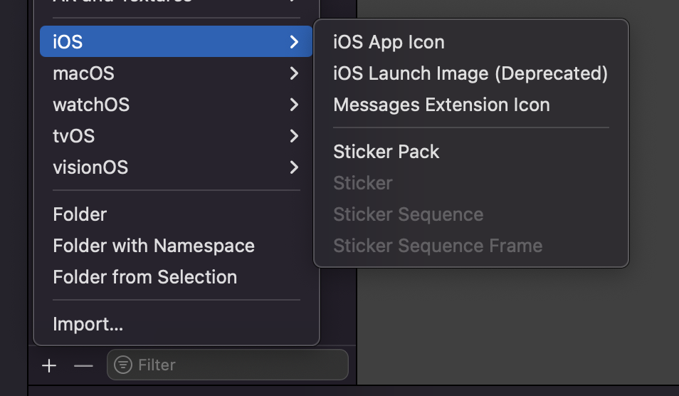
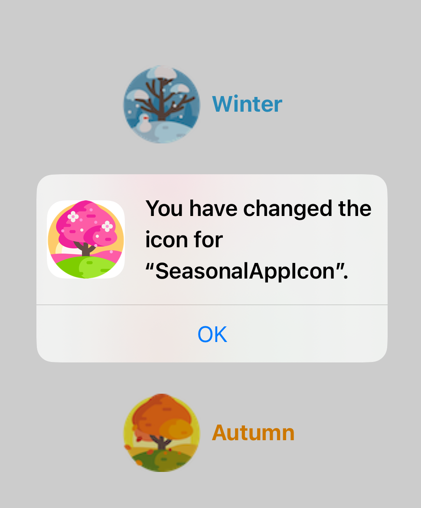
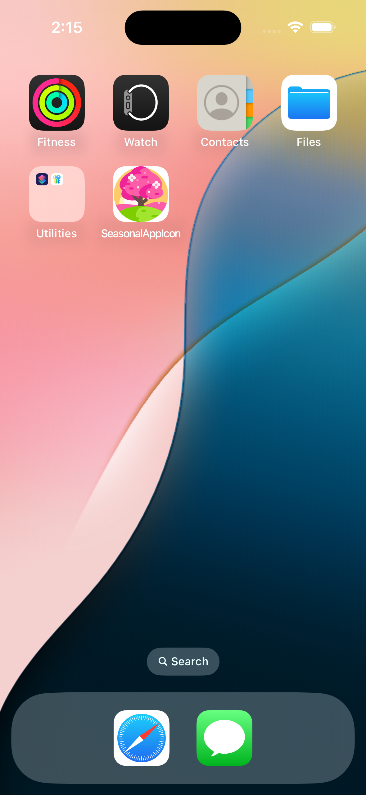

# Seasonal app Icon
Change and alternate between other AppIcon's programmatically.


## Steps:
**1.** Open the Assets file then add a new AppIcon for each desired design, give it a meaningfull name: 




**2.** Call UIApplication.shared.setAlternateIconName() when the needed action is fired:
```
UIApplication.shared.setAlternateIconName("AppIcon-Summer")
```


**Result** 



